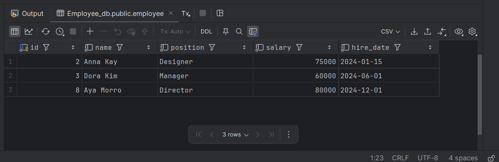

# Employee Database Management Application
Description
*his Java application interacts with a PostgreSQL relational database to manage employee data using JDBC. 
It implements CRUD (Create, Read, Update, Delete) operations for an employee table and is structured with two main classes:*

- Employee: Represents an employee entity with attributes like ID, name, position, salary, and hire date.
- EmployeeData: Handles all database operations such as creating, reading, updating, and deleting employee records.
  
The project adheres to Object-Oriented Programming (OOP) principles, ensuring clean code, encapsulation, and maintainable design.

## Database Setup
Database Name: Employee_db

## Employee Class
The Employee class includes the following fields:

- id (int): A unique, auto-generated identifier.
- name (String): The employee's full name.
- position (String): The employee's job title.
- salary (double): The employee's salary.
- hireDate (Date): The date the employee was hired.
  
## Features of the Class:
- Provides constructors for creating employee objects.
- Implements getters and setters for each field.
- Includes a toString() method for displaying employee information.

## EmployeeData Class
The EmployeeData class manages CRUD operations through JDBC and includes methods for:

Create Employee: Adds a new employee to the database.
- Method: createEmployee(Employee employee)
- Read Employee by ID: Fetches a specific employee's details using their unique ID.
- Method: getEmployeeById(int id)
- Read All Employees: Retrieves a list of all employees in the database.
- Method: getAllEmployees()
- Update Employee: Updates details of an existing employee.
- Method: updateEmployee(Employee employee)
- Delete Employee: Deletes an employee from the database by ID.
- Method: deleteEmployee(int id)

## Database Connection:
The class uses JDBC to establish and manage the connection to the PostgreSQL database. Resources are managed effectively using try-catch blocks and proper closing mechanisms

## How to Run
Prerequisites
Install PostgreSQL and create the database Employee_db.
Run the SQL script above to create the employee table.

## Example Workflow
1. Create Employees:
   Add employees (e.g., John Lee and Cindy Smith) to the database.
2. Retrieve Employee Details:
   Fetch and display details for a specific employee by ID.
4. Update Employees:
   Update the job title and salary for an existing employee.
4. Delete Employees:
   Remove a specific employee by their ID.

## Expected Output
# Before Running
- The employee table is empty.
## After Running
1. Added Employees:
   Two new employees (e.g., John Lee and Cindy Smith) appear in the database.
2. Updated Employee:
   One employee's details are updated with a new position and salary.
3. Deleted Employee:
   One employee is removed from the database, and the table is updated accordingly.

## Sample Screenshots

### Adding Employee

### Updating Employee

### DeletE Employee

## Evaluation Criteria
1. OOP Principles:
Encapsulation, constructors, and getters/setters are effectively used.
2. Code Quality:
The code is clean, follows best practices, and includes proper exception handling.
3. Functional Completeness:
All CRUD operations are implemented and tested.
4. Repository Quality:
Includes a descriptive README with setup instructions and example workflows.

*This project demonstrates how to use Java to interact with relational databases through JDBC. It provides a strong foundation for understanding database management, OOP, and Java application development.*
